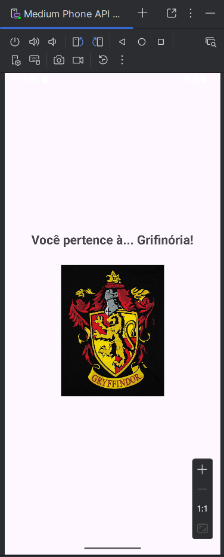

# Chapeu Seletor App 🎩✨

Aplicativo Android que ajuda você a descobrir a qual casa de Hogwarts você pertence: 
**Grifinória, Corvinal, Sonserina ou Lufa-Lufa** 🦁🦅🐍🦡.

## Tecnologias
- Kotlin
- Android Studio
- XML para layout

## Como funciona
1. O usuário escolhe o que mais valoriza.
2. O app sorteia e mostra a casa correspondente.
3. Exibe o brasão da casa na tela de resultado.
